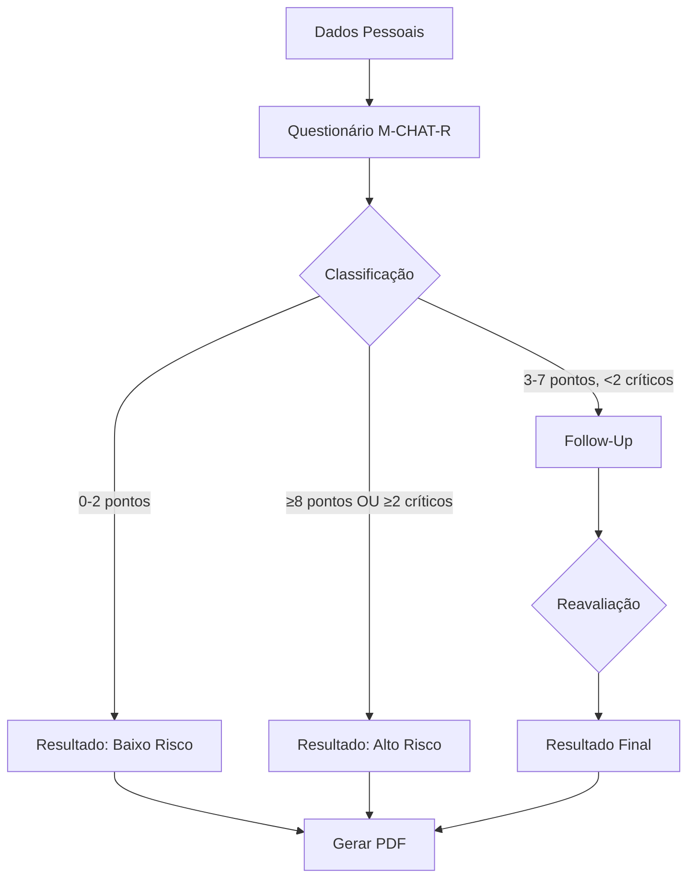

# 🧩 M-CHAT-R/F - Sistema de Triagem de Autismo

Sistema web para aplicação do **M-CHAT-R/F** (Modified Checklist for Autism in Toddlers, Revised with Follow-Up), ferramenta validada para triagem precoce do Transtorno do Espectro Autista (TEA) em crianças de 16 a 30 meses.

[](https://vuejs.org/)
[](https://vitejs.dev/)
[](https://tailwindcss.com/)
[](LICENSE)

## 📋 Sobre o Projeto

O M-CHAT-R/F é um instrumento de triagem baseado em evidências científicas, recomendado pela Academia Americana de Pediatria para identificação precoce de sinais de autismo. Este sistema digitaliza o processo completo de:

- ✅ **Triagem Inicial (M-CHAT-R)**: 20 perguntas sobre comportamento da criança
- ✅ **Follow-Up (M-CHAT-R/F)**: Entrevista estruturada para casos de risco médio
- ✅ **Classificação de Risco**: Baixo, Médio ou Alto
- ✅ **Relatório em PDF**: Documento profissional com resultados e recomendações

### 🎯 Público-Alvo

- Pediatras
- Psicólogos
- Fonoaudiólogos
- Terapeutas ocupacionais
- Profissionais de saúde infantil
- Pesquisadores e estudantes da área

---

## ✨ Funcionalidades

### 📝 Formulário de Dados Pessoais
- Coleta de informações do paciente
- Validação completa de campos
- Cálculo automático de idade
- Persistência de dados em localStorage

### 🧪 Questionário M-CHAT-R
- 20 perguntas padronizadas
- Interface intuitiva com botões Sim/Não
- Barra de progresso visual
- Indicador de perguntas respondidas
- Navegação entre perguntas
- Proteção contra perda de dados (beforeunload)

### 🔍 Follow-Up M-CHAT-R/F
- Entrevista estruturada para casos de risco médio
- Exemplos práticos para cada item
- Classificação Passou/Falhou
- Recálculo automático de risco

### 📊 Tela de Resultados
- Visualização clara do nível de risco
- Gráfico visual de pontuação
- Recomendações clínicas personalizadas
- Lista de itens que falharam
- Indicação de itens críticos

### 📄 Geração de PDF
- Relatório profissional e sóbrio
- Fonte com suporte UTF-8 (caracteres portugueses)
- Layout de 2-3 páginas otimizado
- Todas as informações da avaliação
- Respostas completas do questionário
- Rodapé com paginação

### 🌙 Tema Escuro
- Toggle de tema (claro/escuro)
- Persistência da preferência
- Transições suaves
- Ótima legibilidade em ambos os modos

### 🔒 Segurança de Dados
- Dados armazenados localmente (localStorage)
- Sem envio para servidores externos
- Privacidade total do paciente
- Avisos antes de perda de dados

---

## 🛠️ Tecnologias

### Core
- **Vue 3** - Framework JavaScript progressivo
- **Vite** - Build tool ultrarrápida
- **Vue Router** - Roteamento SPA

### Estilização
- **TailwindCSS 4** - Framework CSS utility-first
- **PostCSS** - Processamento CSS

### Bibliotecas
- **jsPDF** - Geração de PDF client-side
- **Composition API** - Paradigma moderno do Vue 3

### DevOps
- **Vercel** - Hospedagem e deploy contínuo
- **Git** - Controle de versão

---

## 🚀 Começando

### Pré-requisitos

```bash
Node.js 18+ 
npm ou yarn
```

### Instalação

1. **Clone o repositório**
```bash
git clone https://github.com/efss7/triagem-de-autismo.git
cd triagem-de-autismo
```

2. **Instale as dependências**
```bash
npm install
```

3. **Execute em desenvolvimento**
```bash
npm run dev
```

4. **Acesse no navegador**
```
http://localhost:5173
```

### Build para Produção

```bash
npm run build
```

Os arquivos otimizados serão gerados na pasta `dist/`.

### Preview da Build

```bash
npm run preview
```

---

## 📁 Estrutura do Projeto

```
triagem-de-autismo/
├── public/                 # Arquivos estáticos
├── src/
│   ├── assets/            # CSS e recursos
│   │   └── tailwind.css   # Estilos Tailwind
│   ├── components/        # Componentes Vue
│   │   ├── AppHeader.vue           # Cabeçalho com tema
│   │   ├── DadosPessoaisForm.vue   # Formulário inicial
│   │   ├── QuestionarioMCHAT.vue   # 20 perguntas
│   │   ├── FollowUpMCHAT.vue       # Entrevista follow-up
│   │   ├── ResultadoAvaliacao.vue  # Resultados e PDF
│   │   └── ProgressIndicator.vue   # Indicador de etapas
│   ├── composables/       # Lógica reutilizável
│   │   ├── useMCHAT.js    # Lógica de pontuação
│   │   └── useTheme.js    # Gerenciamento de tema
│   ├── router/            # Configuração de rotas
│   │   └── index.js       # Rotas e guards
│   ├── App.vue            # Componente raiz
│   └── main.js            # Entry point
├── index.html             # HTML base
├── vite.config.js         # Configuração Vite
├── tailwind.config.js     # Configuração Tailwind
├── vercel.json            # Configuração deploy
├── package.json           # Dependências
├── DEPLOY.md              # Guia de deploy
└── README.md              # Este arquivo
```

---

## 🎨 Paleta de Cores

### Tema Claro
- **Primary**: Azul (#3B82F6)
- **Success**: Verde (#10B981)
- **Warning**: Amarelo/Laranja (#F59E0B)
- **Danger**: Vermelho (#EF4444)
- **Background**: Branco (#FFFFFF)
- **Text**: Cinza escuro (#1F2937)

### Tema Escuro
- **Background**: Cinza escuro (#111827, #1F2937)
- **Cards**: Cinza médio (#374151)
- **Text**: Branco/Cinza claro

---

## 🧮 Lógica de Pontuação

### Perguntas Normais (17 perguntas)
- **"SIM"** = Comportamento típico (não pontua)
- **"NÃO"** = Comportamento atípico (pontua 1)

### Perguntas Invertidas (3 perguntas: 2, 5, 12)
- **"NÃO"** = Comportamento típico (não pontua)
- **"SIM"** = Comportamento atípico (pontua 1)

### Itens Críticos
Perguntas: 2, 5, 7, 9, 13, 14, 15

### Classificação de Risco

**BAIXO RISCO** (0-2 pontos)
- Desenvolvimento típico
- Continue monitoramento de rotina
- Não requer Follow-Up

**RISCO MÉDIO** (3-7 pontos E < 2 críticos)
- Requer Follow-Up (entrevista estruturada)
- Reavaliação após esclarecimentos
- Monitoramento próximo

**ALTO RISCO** (≥ 8 pontos OU ≥ 2 críticos)
- Encaminhar para avaliação diagnóstica
- Não requer Follow-Up
- Intervenção precoce urgente

---

## 🔄 Fluxo da Aplicação



---

## 📚 Referências Científicas

- Robins, D. L., et al. (2014). "Validation of the Modified Checklist for Autism in Toddlers, Revised With Follow-up (M-CHAT-R/F)". *Pediatrics*, 133(1), 37-45.
- American Academy of Pediatrics (AAP) - Autism Screening Guidelines
- M-CHAT Official Website: https://mchatscreen.com

---

## 🤝 Contribuindo

Contribuições são bem-vindas! Para contribuir:

1. Fork o projeto
2. Crie uma branch para sua feature (`git checkout -b feature/MinhaFeature`)
3. Commit suas mudanças (`git commit -m 'Adiciona MinhaFeature'`)
4. Push para a branch (`git push origin feature/MinhaFeature`)
5. Abra um Pull Request

### Diretrizes
- Mantenha o código limpo e documentado
- Siga os padrões Vue 3 + Composition API
- Teste todas as funcionalidades
- Atualize a documentação se necessário

---

## 📝 Licença

Este projeto está sob a licença **MIT**. Veja o arquivo [LICENSE](LICENSE) para mais detalhes.

**Nota Importante:** O M-CHAT-R/F é um instrumento de domínio público desenvolvido por Diana Robins, Deborah Fein e Marianne Barton. Este software apenas implementa o questionário de forma digital.

---

## ⚠️ Disclaimer

Este sistema é uma **ferramenta de triagem**, não um diagnóstico. Resultados devem ser interpretados por profissionais qualificados. Sempre consulte um especialista em desenvolvimento infantil ou autismo para avaliação completa.

---

## 👨‍💻 Autor

**Eric Felipe**
- GitHub: [@efss7](https://github.com/efss7)
- Projeto: [triagem-de-autismo](https://github.com/efss7/triagem-de-autismo)

---

## 🌟 Agradecimentos

- Diana Robins, PhD - Criadora do M-CHAT-R/F
- Comunidade Vue.js
- Profissionais de saúde que utilizam a ferramenta

---

## 📞 Suporte

Para dúvidas, sugestões ou problemas:
- Abra uma [Issue](https://github.com/efss7/triagem-de-autismo/issues)
- Entre em contato via GitHub

---

**Desenvolvido com ❤️ para auxiliar na identificação precoce do autismo**
